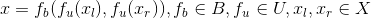
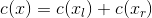

Tchisla

---

Attempt to provide a general solution to solving [Tchisla](https://itunes.apple.com/us/app/tchisla-number-puzzle/id1100623105?mt=8).

In the current approach, this is the same as creating a dynamic path according to the following heuristic:

as

in an iterative procedure.

See the [implementation](main.py) for details and more documentation.
